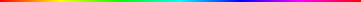

# Rotational Growth Photoshop Script

## How did this, become this, become that?

Did you know that if you repeatedly rotate an image in Photoshop (likely any app / framework with same interpolation algorithms), it eventually breaks down and may produce something similar to a differential growth alogrithm?

> 
> 
> ***The start:** HSB gradient (hue = 0–360, s = 100, b = 100), 361 × 2 px*

> 
> 
> ***And then:** the above image rotated by 2 degrees, 360 times (a.k.a 2 full revolutions)*

> 
> 
> ***But THEN:** the start image rotated by 2 degrees, 10800 times (a.k.a 60 full revolutions)*

Wild... you should see it as an animation: YOUTUBE link.

---

## How to

This only works in Photoshop (though I’ll add any other language / app variations I can verify).

It’s generally good to have a canvas that’s bigger than the image you want to alter, but you can always change that later too. You’ll also probably want to save the file as `Large Document Format` (.psb) before you begin as the file size gets real big, real fast.

- Select a layer to apply the script to.
- Go to `File` menu, choose `Scripts`, then `Browse…` and select the file you downloaded from here
- You will be prompted to input the settings you would like to use:
    - Number of degrees of rotation `-360 — 360`. Integer or decimal
    - Number of revolutions `2 – 300+ (be sane tho)`. Integers only
    - Interpolation method. One of the four text choices
- Sit back and wait 🍸

---

## Examples of settings:

### Interpolation (2 degrees by 60 revolutions):

> **bicubic**
>
> 

> **bicubicSharper**
>
> 
>
> the best IMHO

> **bicubicSmoother**
>
> 

> **nearestNeighbor**
>
> 

### Degrees (by 60 revolutions):

> **2 degrees**
>
> 

---

### Caveats:

- Rotating by 0 (obvs), (-)90, (-)180, (-)270, or (-)360 will produce no real results
- a single pixel, or very small amounts of pixels may not produce any real results
- same for very tiny degrees of rotation (e.g. .001)
- small degrees of rotation will take forever, as will large numbers of revolutions

### Possible Titles:

- Rotating into Oblivion, Rotating Images into Oblivion
- Growtations, Growthations, Grothations
- Big Bang, like the expansion of the universe if you just stir it up.

### Related / Research / etc.:

- Differential Growth links
- Emergent behavior

---

by [JK Keller](https://jk-keller.com), dilettante 🔮 coder, use at your own risk 🕳

https://jk-keller.com/o__o/rotational_growth
